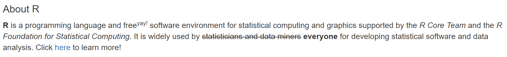
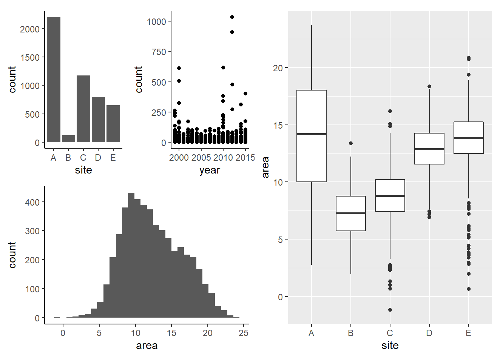

### Plain Text Formatting {#topofpage}  

### Exercise 1  

***



***

Update the text below to match the screen shot above.  

About R  
R is a programming language and free yay! software environment for statistical computing and graphics supported by the R Core Team and the R Foundation for Statistical Computing. It is widely used by statisticians and data miners everyone for developing statistical software and data analysis. Click here to learn more!


### Adding Code Chunks 

Code is stored in *chunks* which are visible in the RMarkdown script by their gray background.


### Exercise 2  
Create a code chunk that  

- imports the fish.txt data set  
  - stores it in an object called fish  
- calculates the average value of the count variable  
  - stores it in a object called mean_count  
- outputs the value of mean_count  

### In-Line Code...  

#### ...With Evaluation  

#### ...Without Evaluation

### Exercise 3  

Fill in the blanks with in-line code; the first blank will be the average `area` and the second blank will either be "greater than" or "less than". Make sure that the reader can see that "area" is the name of a variable. 

The average area sampled in the fish data set was _____, which is _____ 10.

### Doing More with Code Chunks  

*I don't want my code to be displayed in the document*

*I want my code to be displayed in the document but I don't want it to be evaluated*

*I want my input code and output code to be displayed as a single block*

*I don't want warnings or messages to be displayed as output in the document*  

*I want to name this chunk of code so I can easily find it later*


### Figures in RMarkdown  

Figures appear in-line in the document.  


### Exercise 4  

Create a figure; use the RMarkdown cheat sheet to figure out how to use options to resize the figure and align it to the center of the document page.  


*Note:* Click [here](#topofpage) to go back to the header called Header 1.  

### Patchwork  
Patchwork is a package for arranging ggplots!

The `+` operator simply combines plots without telling patchwork anything about the desired layout. For the special case of putting plots besides each other or on top of each other patchwork provides two shortcut operators. `|` will place plots next to each other while `/` will place them on top of each other. 

```{r echo = FALSE, message = FALSE}
library(patchwork)

p1 <- ggplot(fish) +
  geom_bar(aes(x = site)) +
  theme_bw()

p2 <- ggplot(fish) +
  geom_point(aes(x = year, y = count)) +
  theme_bw()

p3 <- ggplot(fish) +
  geom_histogram(aes(x = area))
```

```{r, message = FALSE}
# Arrange all three plots together
```

```{r, message = FALSE}
# Arrange plots 1 and 2 above plot 3
```


```{r, message = FALSE}
# Arrange plots 1 and 2 above plot 3
# use theme_classic for all plots

```

### Exercise 5  

{width=75%}

Write the code used to generate the screen shot above.  

```{r, message = FALSE}
p4 <- ggplot(fish) + 
  geom_boxplot(aes(x = site, y = area))


```

### Tables in RMarkdown  

Data frames (tables) are printed in standard output format. 


The `rmarkdown` package has a built in function called `kable()` which is used for producing "nicely" formatted tables.  

The `kableExtra` package is specifically used to further enhance tables created using `kable()`.  


```{r}
# Make the first row bold and italic

```

```{r}
# Make the first column have a black background and white font

```

Use `?kable_styling()` to explore the many optional arguments this function has; try using `full_width`, `font_size`, and `position`.


### Interactive Components  

Create a drop down menu that allows a user to select a site from the list:  


The figure is updated based on the users selection:  


### Maps in RMarkdown

First we need to find some data that includes latitude and longitude.

**Creating a Map**  

**Adding Popup Labels**  

### More Features  

- Table of Contents 
- Code Folding  
- Parameterization  

### More Resources  
[Bookdown: An Extension of RMarkdown for Writing Digital Books](https://bookdown.org/yihui/rmarkdown-cookbook/)